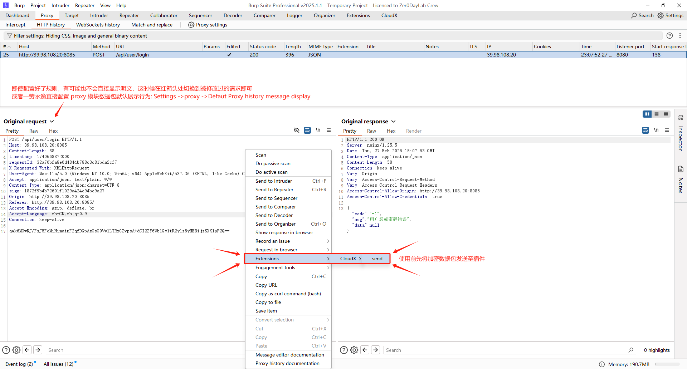
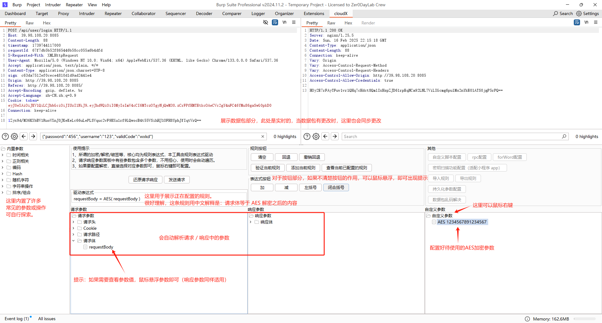
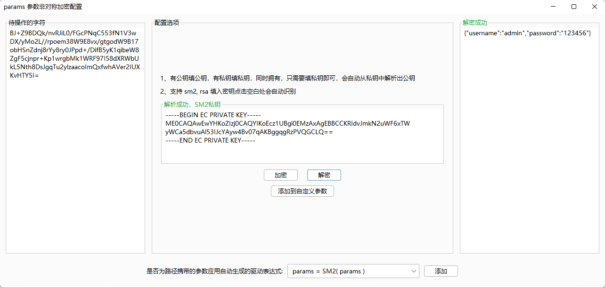
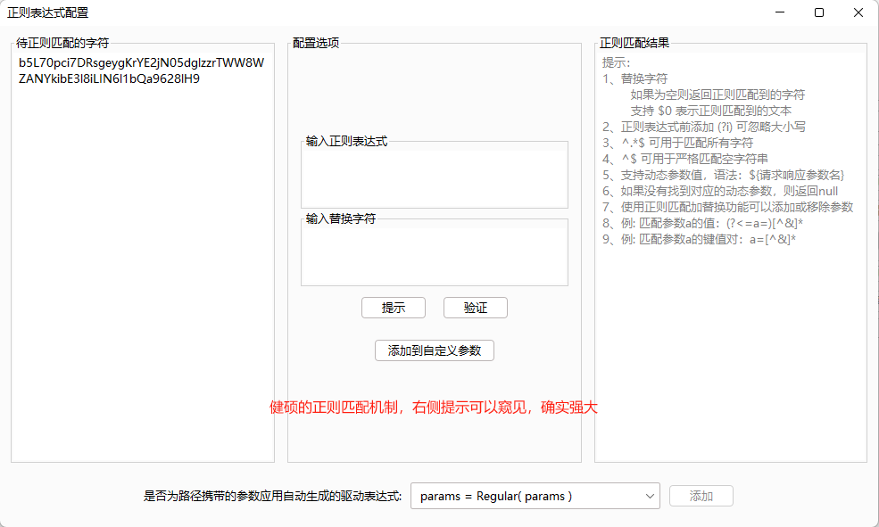
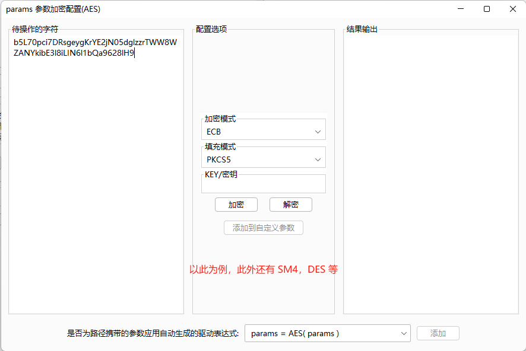

> 一直以来，我都在思考渗透测试过程中加密 防重放 签名的最优解决方案，市面上也出现了很多成熟的方案及工具，但始终无法在用户代码水平和更灵活之间找到平衡，有一段时间，我甚至认为无解，但最终，我还是找到了解决方案，这也是我认为的最终解决方案。

**工具的所有行为均由规则驱动，规则是绝对的，它几乎能做到任何事。**

## 使用须知：

1. 只支持 open JDK or JRE 启动的 Burp
  
2. 采用Montoya API开发，不支持老版本Burp，只会不断适配优化Burp最新版本的使用体验
  
3. 工具设计原则：所有进入Burp的数据包都是明文数据包，发出的数据包均为加密数据包（过程中用户无感知）
  
4. 理论上来说，本工具没有加密解密破签的说法，所有的一切均由规则驱动，所以配置规则才是用户需要做的事情
 
## 未来方向：

1. 完善未实现的功能
  
2. 自动生成规则增强（时间戳规则，自动穷举生成破签规则/解密规则）

## 待定方向：
  
1. 引入 ai（无法保证数据安全，大概率即使实现也默认关闭）
   
2. 通过请求路径排除数据包（黑名单）（不执行规则）

## 步骤1、

## 步骤2、

## 部分功能展示：

